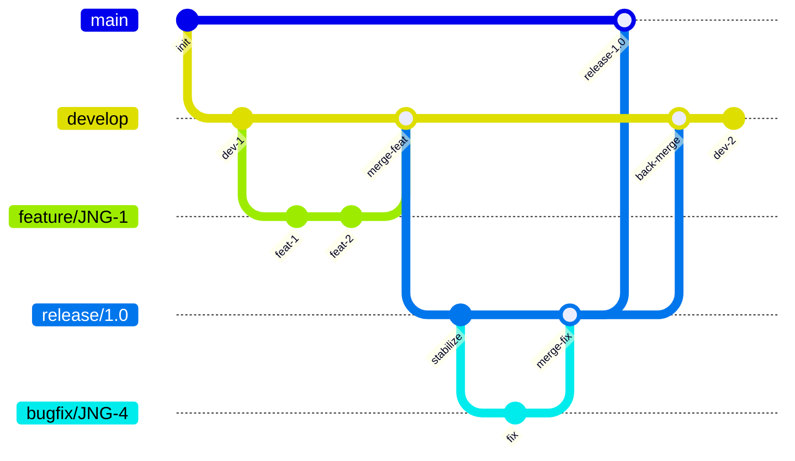
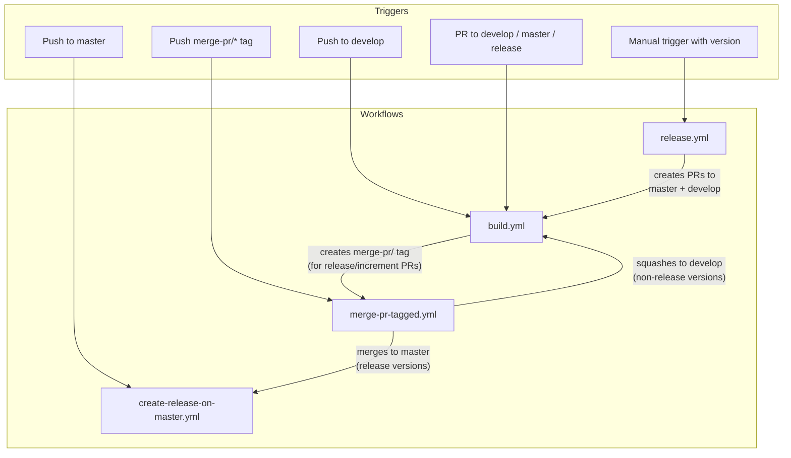
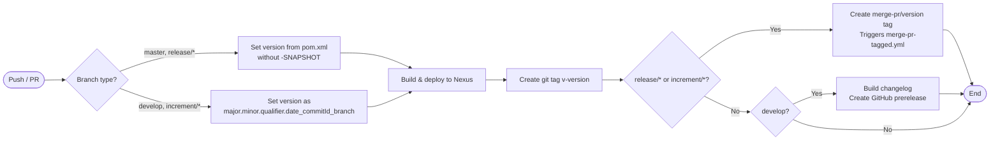
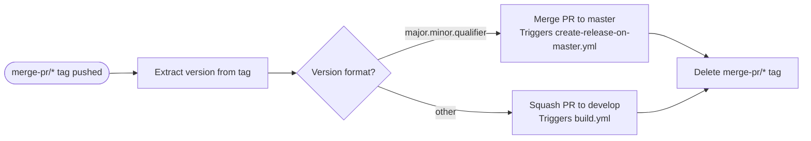
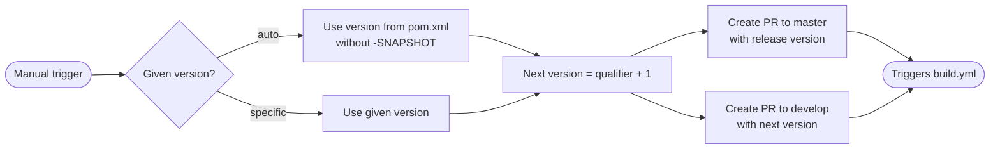

# CI/CD Flow: Development Versioning and Branch Handling

This document describes the branching strategy, versioning policy, and GitHub Actions CI/CD pipeline used by this project. The workflow is based on GitFlow, adapted for automated releases via GitHub Actions.

## Branching Strategy

The project follows a [GitFlow-based workflow](https://www.atlassian.com/git/tutorials/comparing-workflows/gitflow-workflow) with five branch types:

| Branch Pattern | Base Branch | Purpose |
|---------------|-------------|---------|
| `develop` | — | Main development branch; contains latest sources of the active version |
| `feature/JNG-NUMBER_summary` | `develop` | New feature work; merged back to `develop` when complete |
| `release/X.Y.Z` or `X_Y_Z` | `develop` | Release stabilization; `release/` prefix is reserved for CI |
| `bugfix/JNG-NUMBER_summary` | release branch | Bug fixes during release testing; applied to release and newer develop |
| `support/JNG-NUMBER_summary` | release branch | Minor changes to a previous release |
| `hotfix/JNG-NUMBER_summary` | `master` | Critical fixes applied to both `master` and release branches |
| `master` | — | Contains the latest released (stable) sources |

### Branch Lifecycle

## Version Numbers

Versions follow semantic versioning with these rules:

| Event | Version Change |
|-------|---------------|
| Start a `feature/` branch | No version change |
| Start a `release/` branch | Increment 2nd number on `develop` |
| Start a `bugfix/` branch | No change (applied to release during testing) |
| Start a `support/` branch | Increment 3rd number |
| Start a `hotfix/` branch | Increment 4th number |

## GitHub Actions Workflows

The CI/CD pipeline consists of four interconnected workflows that automate building, testing, deploying, and releasing.

### Pipeline Overview

### build.yml

Triggered on pushes to `develop` or pull requests targeting `develop`, `master`, `increment/*`, or `release/*`.

### merge-pr-tagged.yml

Triggered when a `merge-pr/*` tag is pushed. Routes the merge based on version format:

### create-release-on-master.yml

Triggered on push to `master`. Builds a changelog and creates a GitHub release (marked as "latest").

### release.yml

Triggered manually with a version parameter (`'auto'` or `major.minor.qualifier`):

## Development Rules

> **Important:** There is no commit without a ticket number. Every pull request and commit must include a JIRA ticket reference in the format `JNG-xxx`.

Issue tracking uses [JIRA](https://blackbelt.atlassian.net/jira/dashboards).
