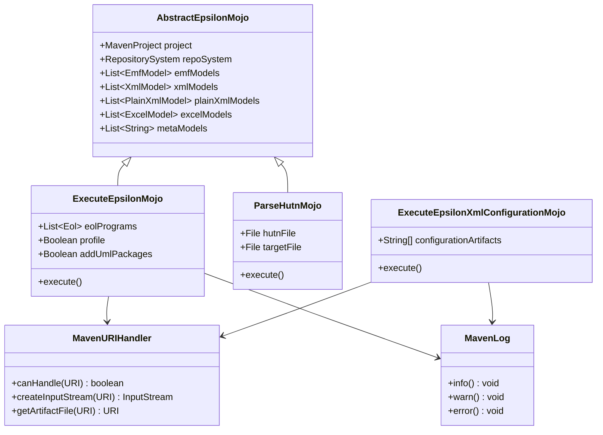
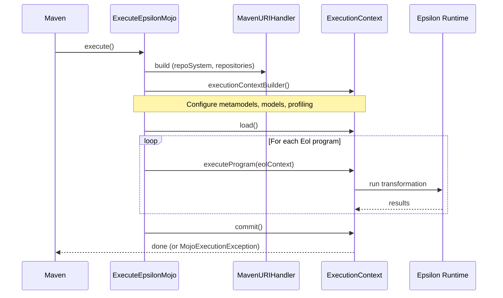
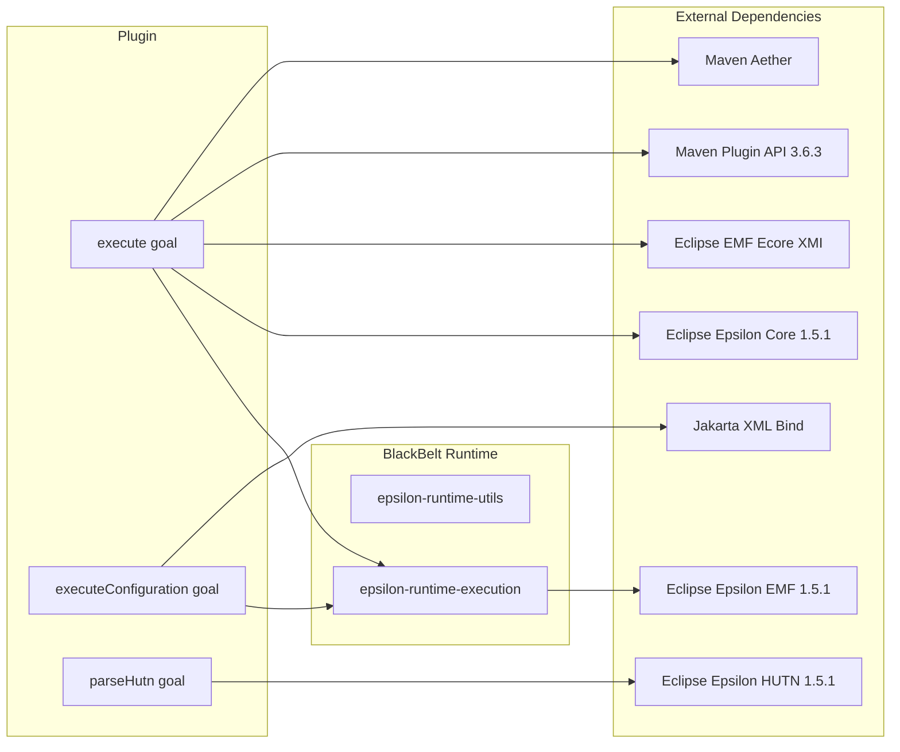

# Contributing to epsilon-maven-plugin

This guide covers everything you need to get started contributing to the epsilon-maven-plugin, a Maven plugin that runs Eclipse Epsilon model transformation scripts from Maven builds.

## Development Environment Setup

### Required Tools

| Tool | Version | Download |
|------|---------|----------|
| JDK | 11 (Zulu JDK recommended) | [Azul Zulu JDK 11](https://www.azul.com/downloads/?version=java-11-lts&package=jdk) |
| Maven | 3.8.x | [Apache Maven](https://maven.apache.org/download.cgi) |

> **Note:** The project includes a Maven wrapper (`./mvnw`), so a system Maven installation is optional.

### Verifying Your Setup

Check Java version — you should see JDK 11:

```sh
java -version
# Expected output similar to:
# openjdk version "11.0.14" 2022-01-18 LTS
# OpenJDK Runtime Environment Zulu11.54+23-CA (build 11.0.14+9-LTS)
# OpenJDK 64-Bit Server VM Zulu11.54+23-CA (build 11.0.14+9-LTS, mixed mode)
```

Check Maven version:

```sh
mvn -version
# Expected: Apache Maven 3.8.x
```

## Project Architecture

This is a single-module Maven plugin project (no sub-modules). It provides three Maven goals for running Epsilon transformation scripts and parsing HUTN files.

### Component Overview



### Execution Flow

The core execution pattern is shared by all goals — build an `ExecutionContext`, load models, run programs, then commit results:



### Dependency Graph



## Build Commands

```sh
# Run tests
mvn clean test

# Full build and install to local repo
mvn clean install

# Full build with JaCoCo code coverage report
mvn clean verify
```

## Submission Guidelines

### Submitting an Issue

Before filing a new issue, search the [issue tracker](https://github.com/BlackBeltTechnology/epsilon-maven-plugin/issues) — your problem may already be reported or resolved.

When filing a bug report, include:

- Output of `java -version` and `mvn -version`
- Your `pom.xml` or `.flattened-pom.xml` (if applicable)
- A minimal reproduction case that demonstrates the failure

A minimal reproduction is essential — it lets maintainers quickly confirm the bug and ensures the right problem gets fixed.

File new issues via the [issue form](https://github.com/BlackBeltTechnology/epsilon-maven-plugin/issues/new/choose).

### Submitting a Pull Request

This project uses [GitHub's standard forking model](https://guides.github.com/activities/forking/). Fork the repository, create a feature branch, and submit a pull request.

For details on the CI/CD pipeline and branch conventions, see the [CI Flow](CIFLOW.md) documentation.
